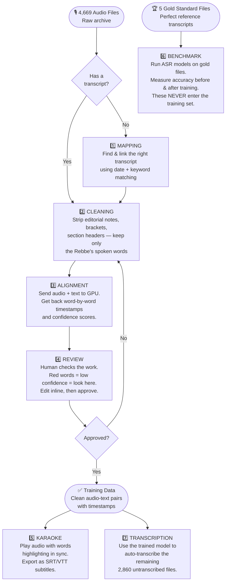
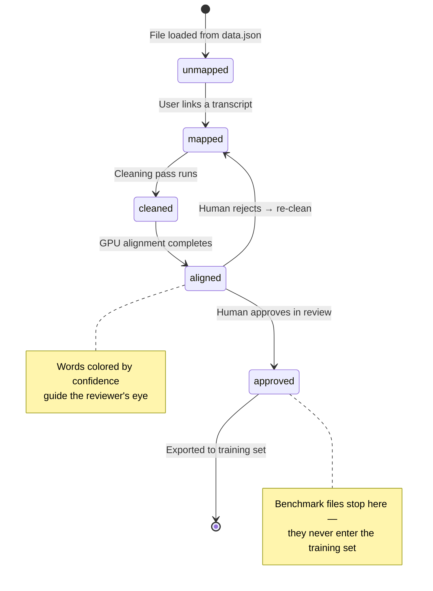

# JEM Yiddish ASR Workbench

> **What is this?** A browser-based tool that turns thousands of raw Yiddish audio recordings into clean, labeled training data for an AI speech recognition model — with no backend server required.

---

## The Big Picture

JEM (Jewish Educational Media) has thousands of recordings of the Lubavitcher Rebbe's talks (1950–1992). Most have never been transcribed. The goal: train an AI that can automatically transcribe Yiddish speech, then use it to make the entire archive searchable.

To train that AI, we need **50 hours of verified audio-text pairs**. This app is the workbench that produces them.

---

## The User Journey

Every audio file moves through a pipeline from raw → ready. Here's the full flow:



---

## Component Map

How the pieces connect:

```mermaid
graph LR
    subgraph Browser["🌐 Browser (your computer)"]
        UI[index.html\nThe single page]
        APP[app.js\nWires everything together]
        STATE[state.js\nAll data lives here\nlocalStorage + Supabase]
        DB[db.js\nSupabase client\nsync + load]
        TABLE[table.js\nThe main table view]
        MAP[mapping.js\nMatch audio ↔ transcript]
        CLEAN[cleaning.js\nStrip editorial noise]
        REV[review.js\nHuman verification panel]
        KAR[karaoke.js\nAudio player + word sync]
        BENCH[benchmark.js\nWER/CER scoring]
        UTIL[utils.js\nShared helpers]
    end

    subgraph CF["☁️ Cloudflare (the cloud)"]
        PAGES[Cloudflare Pages\nHosts the app]
        W1[/api/align\nProxy Worker]
        W2[/api/audio\nProxy Worker]
        W3[/api/transcript\nProxy Worker]
        R2[(R2 Bucket\naudio.kohnai.ai\nAudio + transcript files)]
    end

    subgraph SB["🗄️ Supabase (JEM-ASR-Workbench)"]
        SBDB[(PostgreSQL\nxqivwkksimsvxsxhnzsj\nmappings, alignments,\nreviews, transcript_edits,\naudio_files, transcripts)]
    end

    subgraph GPU["⚡ GPU Server"]
        RUNPOD[align.kohnai.ai\nRunPod endpoint\nYiddish-tuned Whisper]
    end

    UI --> APP
    APP --> STATE
    APP --> DB
    STATE --> DB
    APP --> TABLE
    APP --> MAP
    APP --> CLEAN
    APP --> REV
    APP --> KAR
    APP --> BENCH
    STATE --> UTIL
    MAP --> UTIL
    BENCH --> UTIL

    Browser --> CF
    DB --> SB
    W1 --> RUNPOD
    W2 --> R2
    W3 --> R2
```

---

## What Each Mode Does

### 1. Mapping — *"Which transcript goes with this recording?"*
The archive has 4,669 audio files and 1,065 transcripts. They weren't linked. The app compares Hebrew dates and content type in filenames to suggest matches — ranked by confidence. The reviewer clicks to confirm or uses the search modal to find manually.

### 2. Cleaning — *"Strip the editor's notes, keep only the spoken words"*
Transcripts were prepared by human editors who added notes, section headers, and markers. Five regex passes remove all of that:
- `[brackets]` → removed
- `(parenthetical notes)` → removed
- Section markers like `סעיף א׳` and `* * *` → removed
- Zero-width characters, smart quotes → normalized
- Extra whitespace and blank lines → collapsed

**Clean Rate** = what percentage of words survived. Below 50% means something looks wrong.

### 3. Alignment — *"Match each word to its exact timestamp in the audio"*
The cleaned text and audio are sent to a GPU server (RunPod) running a Yiddish-tuned Whisper model. It returns every word with a start time, end time, and confidence score. **Important:** The GPU scales to zero when idle — the first call can take ~2.5 minutes to warm up. The app retries automatically.

### 4. Review — *"A human checks the work"*
The review panel shows:
- A diff: original transcript vs. cleaned transcript (removed text in red)
- Every word as a colored chip — 🟢 green (confident), 🟠 orange (uncertain), 🔴 red (check this)
- Inline editing: click any word to fix it
- Approve / Reject / Skip buttons

### 5. Karaoke — *"Listen and watch the words highlight"*
An audio player where words light up as they're spoken. Used to verify alignment quality during review, and to export subtitle files (SRT/VTT) for video players.

### 6. Benchmark — *"Is the AI actually getting better?"*
Five gold-standard files with verified-perfect transcripts are used to measure model accuracy. The app runs them through any configured ASR model and calculates WER (Word Error Rate) and CER (Character Error Rate). **These files are permanently locked out of the training set.**

### 7. Transcription — *"Auto-transcribe the rest of the archive"*
Once the model is trained and benchmark scores look good, this mode sends the remaining 2,860 untranscribed audio files to the fine-tuned model for automatic transcription. The results go through the same review → karaoke → approve pipeline.

---

## The Status Pipeline (one file's journey)



---

## Data & Storage

### Where data lives

| What | Where | Notes |
|------|-------|-------|
| Audio metadata (4,669 files) | `public/data.json` | Loaded on startup, never mutated |
| Transcript metadata (1,065 files) | `public/data.json` | Loaded on startup, never mutated |
| User work (mappings, cleaning, alignment, reviews) | Supabase + `localStorage` | Supabase is primary; localStorage is instant-access cache |
| Audio files | Cloudflare R2 (`audio.kohnai.ai`) | Proxied via `/api/audio` |
| Transcript text | Cloudflare R2 (`audio.kohnai.ai/transcripts-txt/`) | Proxied via `/api/transcript` |

### Supabase database (JEM-ASR-Workbench)
- **Project ref:** `xqivwkksimsvxsxhnzsj`
- **URL:** `https://xqivwkksimsvxsxhnzsj.supabase.co`
- **RLS:** All tables have `public_read_write` policy (anon key has full access)
- **Tables:**

| Table | PK | Contents |
|-------|-----|---------|
| `audio_files` | `id` | All audio file metadata |
| `transcripts` | `id` | Transcript metadata |
| `mappings` | `audio_id` | Audio → transcript links + confidence |
| `alignments` | `audio_id` | Word timestamps + confidence scores |
| `reviews` | `audio_id` | Approval status + edited text |
| `transcript_edits` | `(audio_id, version)` | Cleaned/edited text versions |
| `asr_models` | `id` | ASR model configurations |
| `benchmark_results` | `id` | WER/CER benchmark run results |
| `latest_edits` | — | View: most recent edit per audio |

- **FK constraint:** `mappings`, `alignments`, `reviews`, `transcript_edits` all have FK → `audio_files.id`. `db.js` upserts the audio file row first before writing related rows.

### Sync flow
- **Startup:** `loadFromSupabase()` fetches all 4 tables in parallel → `mergeSupabaseData()` merges over localStorage → table re-renders. Runs in background, app is usable immediately from localStorage.
- **Every change:** `updateState()` saves to localStorage instantly, then calls `syncStateKey()` fire-and-forget to upsert the changed row in Supabase.

### Exporting your work
- **Export State** button → downloads a JSON file of all your work (mappings, cleaning, alignments, reviews)
- **Export CSV** button → downloads only the approved rows, ready for training
- Work is now cloud-synced — moving computers just means opening the app (Supabase loads automatically)

---

## The 5 Benchmark Files (locked forever)

These files have verified-perfect transcripts and are used only for measuring model quality:

```
0015--5711-Tamuz 12 Sicha 1.mp3
0142--5715-Tamuz 13d Sicha 3.mp3
2781--5741-Nissan 11e Mamar.mp3
0003--5711-Shvat 10c Mamar.mp3
2925--5742-Kislev 19 Sicha 1.mp3
```

The app enforces: no "Approve" button on these rows, never included in training exports, always shown with a purple "Benchmark" badge.

---

## Keyboard Shortcuts

| Key | What it does |
|-----|-------------|
| `↑` / `↓` | Move between rows |
| `Enter` | Approve the current row |
| `S` | Skip (decide later) |
| `R` | Reject (needs re-cleaning) |
| `E` | Toggle word edit mode |
| `Space` | Play / pause audio |
| `←` / `→` | Seek audio ±5 seconds |
| `/` | Jump to search box |
| `Escape` | Close any modal |
| `Ctrl+A` | Select all visible rows |
| `Ctrl+E` | Export state as JSON |
| `Ctrl+Shift+E` | Export approved rows as CSV |

---

## Success Looks Like

1. All 423 pairs in the 50-hour set: mapped → cleaned → aligned → reviewed → approved
2. Zero benchmark files in the training export
3. WER score drops after fine-tuning (e.g., Whisper baseline 45% → fine-tuned 18%)
4. The remaining 2,860 audio files transcribed automatically
5. Subtitle files generated for video playback

---

---
---

# Technical Reference (for developers)

---

## Build Rules
- Vite + vanilla JS ESM. No frameworks.
- Named exports only. No default exports.
- Modules import only from `src/utils.js`, `src/state.js`, and `src/db.js` as shared deps.
- `.env` holds `VITE_SUPABASE_URL` and `VITE_SUPABASE_ANON_KEY` — baked in at build time by Vite.

## File Structure

```
jem-asr-app/
├── index.html                  # Single page shell
├── detail.html                 # Per-file detail page
├── style.css                   # Dark theme, RTL, responsive
├── .env                        # VITE_SUPABASE_URL + VITE_SUPABASE_ANON_KEY (build-time)
├── src/
│   ├── app.js                  # Entry: load data.json, init state, wire everything
│   ├── state.js                # State management, localStorage + Supabase sync
│   ├── db.js                   # Supabase client, loadFromSupabase(), syncStateKey()
│   ├── table.js                # Unified table: filters, sort, pagination, bulk select
│   ├── mapping.js              # Matching algorithm, suggested matches, search modal
│   ├── cleaning.js             # 5-pass regex cleaner, clean rate, batch clean
│   ├── alignment.js            # RunPod API calls, confidence parsing, batch align
│   ├── review.js               # Diff viewer, inline editing, approve/reject
│   ├── karaoke.js              # Audio player, word highlighting, SRT/VTT export
│   ├── benchmark.js            # ASR API config, WER/CER calculator, comparison table
│   ├── detail.js               # Per-file detail page logic
│   └── utils.js                # parseHebrewDate, normalizeYiddish, levenshtein, CSV
├── functions/api/
│   ├── align.js                # CF Worker: POST proxy → align.kohnai.ai/api/align
│   ├── audio.js                # CF Worker: GET proxy for R2 audio (streams, 1-day cache)
│   └── transcript.js           # CF Worker: GET proxy for transcript text from R2
├── public/data.json            # Pre-computed metadata (~246KB)
├── wrangler.toml
└── package.json
```

## State Architecture

### Primary store: `transcriptVersions`

Each audio file has a chain of transcript versions:

```javascript
state.transcriptVersions["a_001"] = [
  { id, type: "manual",  sourceTranscriptId, confidence, matchReason, createdAt },
  { id, type: "cleaned", text, originalText, cleanRate, createdAt },
  { id, type: "asr",     text, model, createdAt },
  // Any version can also carry:
  //   .alignment = { words, avgConfidence, lowConfidenceCount, alignedAt }
  //   .review    = { status, editedText, reviewedAt }
]
```

Version priority (getBestVersion): `edited > cleaned > asr > manual`

### Legacy keys (auto-synced)

`syncLegacyKeys(audioId)` keeps these flat objects in sync from `transcriptVersions`:
`state.mappings`, `state.cleaning`, `state.alignments`, `state.reviews`

Direct writes via `updateState()` still work. Legacy keys exist for simpler reads.

### getStatus state machine

```javascript
versions.some(v => v.review?.status === 'approved')  → 'approved'
versions.some(v => v.review?.status === 'rejected')  → 'rejected'
versions.some(v => v.alignment)                       → 'aligned'
versions.some(v => v.type === 'cleaned')              → 'cleaned'
versions.length > 0                                   → 'mapped'
else                                                  → 'unmapped'
```

Falls back to legacy keys if `transcriptVersions` is empty.

## Module Exports

### state.js
```javascript
initState(data), getState(), updateState(key, audioId, value)
getStatus(audioId), getVersions(audioId), getVersionsByType(audioId, type)
getBestVersion(audioId), addVersion(audioId, data), updateVersion(audioId, versionId, updates)
getFilteredRows(filter, searchTerm, sortCol, sortDir, yearFilter, monthFilter, typeFilter)
getFilterCounts()         // returns counts for all filter pill keys
mergeSupabaseData(remote) // merge cloud data into state; called once on startup
exportState(), importState(json)
```

### db.js
```javascript
loadFromSupabase()                              // → { mappings, alignments, reviews, cleaning }
syncStateKey(key, audioId, value, audioEntry)  // dispatch upsert for the changed key
syncMapping(audioId, mapping, audioEntry)
syncCleaning(audioId, cleaningData, audioEntry)
syncAlignment(audioId, alignmentData, audioEntry)
syncReview(audioId, reviewData, audioEntry)
deleteMapping(audioId)
```

`ensureAudioFile(audio)` is called internally before any write that has a FK → `audio_files.id`.

### mapping.js
```javascript
getSuggestedMatches(audioItem, allTranscripts, existingMappings)  // → [{transcript, score, matchReason}]
renderSuggestedMatches(container, audioId, state, onLink)          // container is FIRST param
linkMatch(audioId, transcriptId, confidence, reason)
unlinkMatch(audioId)
renderSearchModal(container, state, onSelect)
```

### cleaning.js
```javascript
cleanBrackets(text), cleanParentheses(text), cleanSectionMarkers(text)
cleanSymbols(text), cleanWhitespace(text)
cleanText(raw)        // all 5 passes in sequence
cleanRate(raw, cleaned)   // = calculateCleanRate (both exported, equivalent)
batchClean(audioIds, state)
```

### review.js
```javascript
renderReviewPanel(container, audioId, state, callbacks)  // container is FIRST param
approveAll(selectedIds, state)
setupKeyboardNav(callbacks)
```

Confidence chip classes: `.confidence-high` (≥0.8), `.confidence-mid` (≥0.4), `.confidence-low` (<0.4)

### alignment.js
```javascript
alignRow(audioId, state)              // retries 3× on 502/504 with 10s delay
batchAlign(audioIds, state, onProgress)
transcribeAudio(audioId, audioUrl, modelConfig)
```

Request to `/api/align`:
```json
{ "mode": "align", "audio_base64": "...", "audio_format": ".mp3", "text": "...", "language": "yi" }
```

Response parsing: `data.timestamps[]` first, fallback to `data.segments[].words[]`. Confidence field: `confidence → probability → score`.

### karaoke.js
```javascript
renderKaraokePlayer(audioId, state)   // appends modal to document.body
downloadFile(content, filename, mimeType)
```

### benchmark.js
```javascript
renderAsrConfig(container, state)
runBenchmark(benchmarkAudioIds, state, onProgress)
renderBenchmarkTable(container, state)
```

API keys (`asrModels[].apiKey`) are **never exported** in state JSON.

### utils.js
```javascript
parseHebrewDate(filename)           // → { year, month, day }
normalizeYiddish(text)              // strip nikkud U+0591-U+05C7, punct, lowercase
levenshtein(refWords, hypWords)     // → { distance, operations: [{type:'S'|'I'|'D', ref, hyp}] }
calculateWER(reference, hypothesis) // → { wer, cer, substitutions, insertions, deletions, total }
generateSRT(words)                  // group on gap>0.5s or every ~10 words
generateVTT(words)
exportCSV(rows, columns)            // triggers download
truncateWords(text, n)
formatConfidence(score)             // 0.85 → "85%", null → "—" (em dash)
debounce(fn, ms)
```

## data.json Shape

```javascript
{
  "generated": "<ISO timestamp>",
  "allAudio":      [{ name, link, year, month, day, type, estMinutes }],
  "allTranscripts":[{ name, link, year, month, day, firstLine }],
  "matched":       [{ audioName, transcriptName, firstLine }],  // pre-linked pairs
  "selected":      [{ audioName, transcriptName, firstLine }]   // 50-hour training set
}
```

`app.js` assigns IDs (`a_0`…`a_N`, `t_0`…`t_N`), sets `isSelected50hr`, `isBenchmark`, and `r2Link` at startup.

## Filter Keys

Both formats work: `'fifty'` = `'50hr'`, `'fifty-unmapped'` = `'50hr-unmapped'`, etc.

Note: The `'fifty'` view filters to Sicha/Maamar only (filenames containing "sicha", "maamar", "mamar"). Farbrengen files in the 50hr set are excluded.

Valid keys: `fifty`, `fifty-unmapped`, `fifty-mapped`, `fifty-cleaned`, `fifty-aligned`, `fifty-approved`, `all`, `unmapped`, `mapped`, `cleaned`, `benchmark`, `needs-review`, `approved`

## R2 URL Patterns

```
Benchmark audio:  https://audio.kohnai.ai/benchmark/<filename>
Training audio:   https://audio.kohnai.ai/training/<filename>
Transcript text:  https://audio.kohnai.ai/transcripts-txt/<filename>.txt

App proxies all R2 audio via:  /api/audio?url=<encoded-r2-url>
App proxies transcripts via:   /api/transcript?name=<filename>
App proxies alignment via:     /api/align  (POST)
```

## Visual Design

```css
--bg:             #0a0a0f   /* page background */
--surface:        #16162a   /* cards, panels */
--text:           #e8e8f0   /* primary text */
--text-secondary: #8888aa   /* muted */
--accent:         #00d4ff   /* links, active */
--green:          #4ade80   /* high confidence, approved */
--orange:         #fb923c   /* medium confidence */
--red:            #f87171   /* low confidence, rejected */
--purple:         #b366ff   /* benchmark */
```

RTL: `.hebrew-text { direction: rtl; text-align: right; unicode-bidi: embed; }`

Responsive breakpoints: 1200px (full) / 768px (compact) / 480px (card view)

## WER Formula

```
WER         = (S + I + D) / N      (N = reference word count)
CER         = (S + I + D) / C      (at character level)
Custom WER  = (I + D + critical_S) / N

Normalization before comparison:
  Strip nikkud U+0591–U+05C7 → strip punctuation → lowercase Latin → collapse whitespace
```

## Deploy

```bash
npm run build
npx wrangler pages deploy dist/ --project-name jem-asr-app
```

Live: `https://jem-asr-app.pages.dev`
